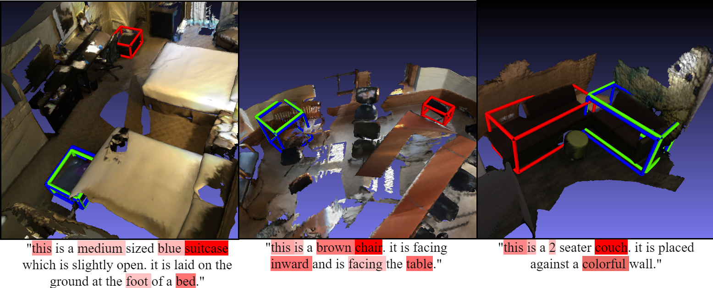

# ScanRefer with Graph and Attention (SRGA)

<p align="center"></p>

## Introduction

In this work, we study the task of 3D object localization using referring natural language expressions. 
We use RGB-D scans of indoor scenes represented in the form of 3D point clouds from the recently introduced ScanRefer dataset. 
The corresponding model ScanRefer treats each object individually and therefore lacks context-awareness. 
Our key technical contribution is designing an approach leveraging a graph neural network and a language self-attention mechanism to improve the understanding of relationships between objects within a scene. 
We show that our model has a better understanding of the language expressions and the interactions between the objects.


## Setup
For information regarding setup, training commands and the ScanRefer baseline model check out:
https://github.com/daveredrum/ScanRefer


## Usage

To train the current SRGA model with multiview features and loading pretrained VoteNet weights:
```shell
python scripts/train.py --use_multiview --use_normal --use_pretrained
```

To visualize the learned attention weights:
```shell
python scripts/visualize_attention.py --folder <foldername> --use_multiview --use_normal
```

## Benchmark results 

<p align="center"></p>


## Acknowledgement
We would like to thank Dave Zhenyu Chen for the continued support on this project and the provided ScanRefer codebase.